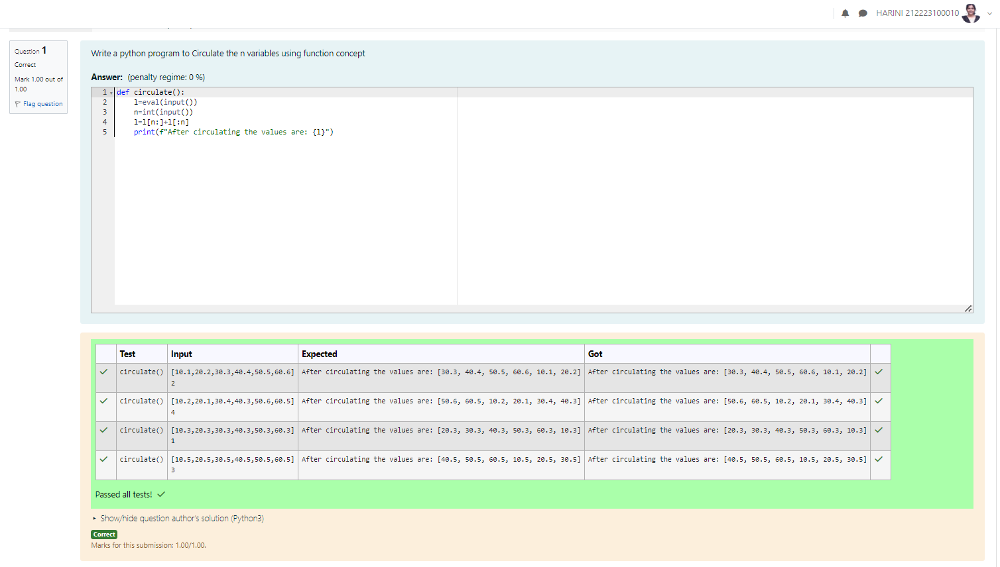

# EX02 Circulate-the-values-of-N-variables
## Aim:
To write a python program to circulate the n variables using function concept
## Equipment’s required:
PC
Anaconda - Python 3.7
## Algorithm: 
### Step 1: 
### Step 2: 
### Step 3: 
Get the value from the user for the number of rotation
### Step 4: 
Using the slicing concept rotate the list

### Step 5: 
Slice the number of values required

### Step 6: 
Then paste it at the back to circulate

## Program:

``````
def circulate():
    l=eval(input())
    n=int(input())
    l=l[n:]+l[:n]
    print(f"After circulating the values are: {l}")
``````


## Output:

## Result:
Hence, the values are circulated successfully.
